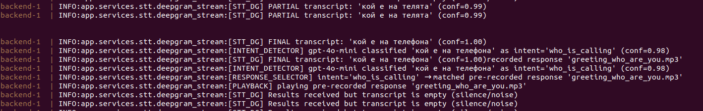
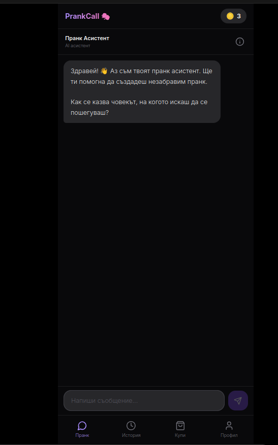
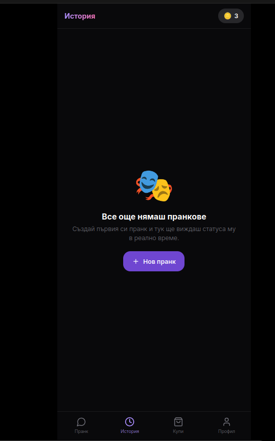
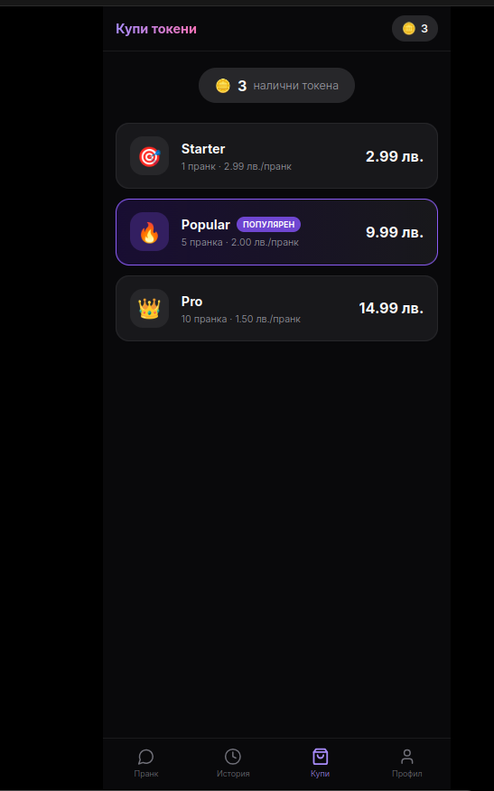
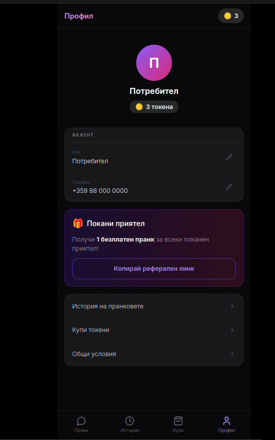

# HaHa

HaHa is an automated calling app that lets users schedule AI-powered phone conversations—greetings, pranks, and custom scripts—directly from their mobile device. The system dynamically generates personalized conversations and manages calls in real-time.

## Features

- Schedule and trigger automated calls via mobile app
- AI-powered voice conversations using real-time STT/TTS
- Call routing and management through Telnyx
- Supports custom scripts and personas, adaptable to different scenarios

## Stack

- **Mobile**: Android (Kotlin)
- **Backend**: Python / FastAPI
- **Calls**: Telnyx
- **STT/TTS**: Deepgram, enhanced by OpenAI APIs for natural-sounding speech

## Under Development

- **Conversation Builder** — a chatbot-style interface to design call scripts and personas using OpenAI `gpt-4o-mini`
- **STT/TTS Pipeline** — real-time speech-to-text and text-to-speech, with post-processing for improved naturalness

### MVP: AI Agent Pipeline

Live call audio is transcribed via Deepgram, then passed through an AI agent chain: an intent detection model (`gpt-4o-mini`) classifies what the caller said, selects the appropriate pre-recorded response, and triggers playback — all in real-time.

> STT (Deepgram) → Intent Detection (gpt-4o-mini) → Response Selector → Playback

## UI

   

